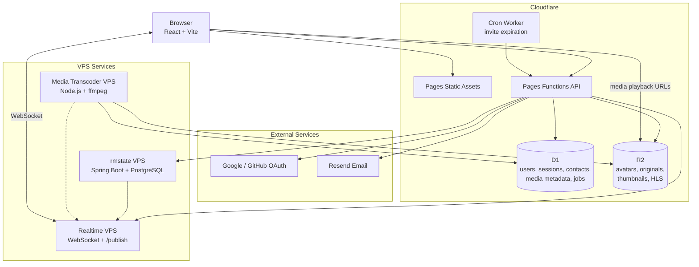

# SWaParty

🎬 Online demo: https://swaparty.org

SWaParty is a multi-user watch party web application. It combines account login, contact and invite workflows, private media upload, realtime presence, synchronized room playback, chat, danmaku-style comments, and a separate Spring room-state service.

This repository is a sanitized public source tree. Real secrets, production resource IDs, VPS IPs, and deployment-specific `.env` files are intentionally excluded.

--- 

## 📚 Contents

- [🚀 Quick Start](#quick-start)
- [✨ Features](#features)
- [🏗️ Architecture](#architecture)
- [🗂️ Software Structure](#software-structure)
- [🧑‍💻 Local Development](#local-development)
- [🖥️ VPS Requirements](#vps-requirements)
- [🔐 Configuration](#configuration)
- [🗄️ Database](#database)
- [☕ rmstate Backend](#rmstate-backend)
- [🎞️ Media Transcoder](#media-transcoder)
- [📖 Documentation](#documentation)
- [🛡️ Security Notes](#security-notes)

---

<a id="quick-start"></a>

## 🚀 Quick Start

Run the frontend locally:

```bash
npm install
npm run dev
```

Default local URL:

```text
http://localhost:5173
```

Check the frontend build:

```bash
npm run lint
npm run build
```

For deployment, start with [Deployment and Secrets Guide](docs/DEPLOYMENT_AND_SECRETS_GUIDE.md). It explains the required Cloudflare resources, VPS roles, `.env` values, shared token relationships, deployment order, and validation checks.

---

<a id="features"></a>

## ✨ Features

- Email registration, email verification, login, password reset, OAuth login, profile settings, avatars, and optional two-factor authentication.
- Contact search, quick contacts, inbox notifications, room invitations, and watch requests.
- Private media library backed by Cloudflare D1 metadata and R2 object storage.
- Multipart browser uploads with R2 presigned URLs.
- Media playback from direct browser-playable files or HLS renditions.
- Optional VPS media transcoder for thumbnails and HLS renditions.
- Realtime WebSocket fanout for presence, profile/contact updates, inbox refreshes, media updates, and room events.
- Watch rooms with host/member roles, synchronized playback, mounted media, chat, danmaku, activity logs, and lifecycle handling.
- Spring Boot `rmstate` backend for room runtime state, connected through Cloudflare Pages Functions as a same-origin backend-for-frontend.

---

<a id="architecture"></a>

## 🏗️ Architecture



Ownership boundaries:

- Cloudflare remains authoritative for accounts, sessions, contacts, media metadata, R2 assets, upload sessions, and transcode jobs.
- The realtime VPS is a thin fanout layer. It should not own durable app state.
- `rmstate` owns room runtime data only. It must not serve video bytes or duplicate the media library.
- The transcoder owns ffmpeg processing and writes generated media outputs back to R2.

---

<a id="software-structure"></a>

## 🗂️ Software Structure

```text
swaparty-github/
|-- src/
|   |-- App.jsx                         Main React app shell and realtime wiring
|   |-- main.jsx                        React entrypoint
|   |-- index.css                       Tailwind/global styles
|   |-- components/
|   |   |-- auth/                       Login, register, verification UI
|   |   |-- lobby/                      Lobby, media library, inbox
|   |   |-- room/                       Watch room, player, chat, danmaku, logs
|   |   |-- profile/                    Profile, security, contacts settings
|   |   |-- legal/                      Legal/policy screens
|   |   `-- common/                     Shared UI pieces
|   |-- lib/                            Frontend caches, realtime buses, helpers
|   `-- routes/                         Route parsing/building helpers
|
|-- public/
|   |-- locales/                        Browser locale JSON
|   |-- _headers                        Cloudflare Pages headers
|   |-- _redirects                      Cloudflare Pages redirects
|   |-- swaparty.svg
|   `-- swaparty.png
|
|-- functions/
|   |-- _lib/                           Shared Pages Functions utilities
|   |-- locales/                        Backend email/message locale modules
|   `-- api/                            Cloudflare Pages Functions API routes
|       |-- auth/                       Auth, OAuth, profile, MFA, password APIs
|       |-- contacts/                   Contacts, invites, inbox APIs
|       |-- media/                      Media library, upload, playback, jobs APIs
|       |-- rooms/                      BFF proxy to rmstate
|       |-- realtime/                   WebSocket token API
|       `-- cron/                       Invite-expiration API
|
|-- workers/
|   |-- invites-expire-cron.js          Scheduled Worker entrypoint
|   `-- media-transcoder/
|       |-- src/index.js                D1 polling, ffmpeg processing, R2 updates
|       |-- Dockerfile
|       |-- package.json
|       `-- .env.example
|
|-- rmstate/
|   |-- src/main/java/org/swaparty/rmstate/
|   |   |-- config/                     CORS, internal auth, app properties
|   |   |-- model/                      Request/response DTOs
|   |   |-- realtime/                   Realtime publish client
|   |   |-- service/                    Room lifecycle and business logic
|   |   `-- web/                        Internal room HTTP API
|   |-- src/main/resources/
|   |   |-- application.yml
|   |   `-- schema.sql                  PostgreSQL room-state schema
|   |-- docker-compose.yml
|   |-- Dockerfile
|   |-- Caddyfile
|   |-- .env.example
|   `-- README.md
|
|-- docs/
|   |-- DEPLOYMENT_AND_SECRETS_GUIDE.md Main deploy/config/secrets guide
|   |-- VPS_REALTIME_DEPLOY.md          Realtime VPS runbook
|   |-- MEDIA_PIPELINE_GUIDE.md         Media pipeline design notes
|   `-- database.sql                    Cloudflare D1 schema
|
|-- .env.example                        Frontend + Pages Functions env template
|-- wrangler.toml                       Cloudflare Pages bindings template
|-- wrangler.cron.toml                  Cron Worker template
|-- package.json
|-- vite.config.js
|-- tailwind.config.js
`-- README.md
```

---

<a id="local-development"></a>

## 🧑‍💻 Local Development

The main frontend workflow is:

```bash
npm install
npm run dev
npm run lint
npm run build
```

The frontend runs through Vite on `http://localhost:5173` by default. Backend API routes are Cloudflare Pages Functions, so full-stack local testing may require Wrangler or deployed Cloudflare resources depending on which feature you are testing.

---

<a id="vps-requirements"></a>

## 🖥️ VPS Requirements

For a full deployment, prepare these VPS roles:

- Realtime VPS: WebSocket connections and `/publish` fanout.
- rmstate VPS: Spring Boot room-state service and PostgreSQL.
- Media transcoder VPS: optional ffmpeg worker for thumbnails and HLS renditions.

Testing can combine services on one machine, but production is easier to operate when these workloads are separated. See [Deployment and Secrets Guide](docs/DEPLOYMENT_AND_SECRETS_GUIDE.md) for Cloudflare secrets, VPS `.env` values, shared-token relationships, deployment order, and validation checks.

---

<a id="configuration"></a>

## 🔐 Configuration

Copy [.env.example](.env.example), [rmstate/.env.example](rmstate/.env.example), and [workers/media-transcoder/.env.example](workers/media-transcoder/.env.example) into the appropriate deployment secret stores and fill in real values there. Do not commit real `.env` files.

Use [Deployment and Secrets Guide](docs/DEPLOYMENT_AND_SECRETS_GUIDE.md) as the main configuration checklist. It explains:

- Cloudflare Pages/Functions secrets.
- Cloudflare D1 and R2 bindings.
- Cron Worker secrets.
- Realtime VPS secrets.
- `rmstate` VPS secrets.
- Media transcoder VPS secrets.
- Which values must match exactly across services.
- Deployment order and validation checks.

---

<a id="database"></a>

## 🗄️ Database

Cloudflare D1 schema:

- [D1 database schema](docs/database.sql)

Spring room-state schema:

- [Spring room-state schema](rmstate/src/main/resources/schema.sql)

---

<a id="rmstate-backend"></a>

## ☕ rmstate Backend

`rmstate` is a Spring Boot service for room runtime state. It exposes internal endpoints under `/internal/rooms/*` and expects Cloudflare Pages Functions to authenticate users first, then forward requests with internal headers.

```bash
cd rmstate
cp .env.example .env
mvn clean package
docker compose up -d --build
```

More details:

- [rmstate/README.md](rmstate/README.md)
- [Deployment and Secrets Guide](docs/DEPLOYMENT_AND_SECRETS_GUIDE.md)

---

<a id="media-transcoder"></a>

## 🎞️ Media Transcoder

The transcoder is a Node.js worker under `workers/media-transcoder`. It polls D1 transcode jobs, downloads originals from R2, runs ffmpeg, writes renditions and thumbnails back to R2, updates D1, and can publish realtime media updates.

```bash
cd workers/media-transcoder
npm install
npm run check
```

Use [workers/media-transcoder/.env.example](workers/media-transcoder/.env.example) as the runtime template.

More details:

- [Media Pipeline Guide](docs/MEDIA_PIPELINE_GUIDE.md)
- [Deployment and Secrets Guide](docs/DEPLOYMENT_AND_SECRETS_GUIDE.md)

---

<a id="documentation"></a>

## 📖 Documentation

Technical documents are grouped under `docs/`:

- [Media Pipeline Guide](docs/MEDIA_PIPELINE_GUIDE.md)
- [Deployment and Secrets Guide](docs/DEPLOYMENT_AND_SECRETS_GUIDE.md)
- [Realtime VPS Deploy Guide](docs/VPS_REALTIME_DEPLOY.md)
- [D1 database schema](docs/database.sql)

---

<a id="security-notes"></a>

## 🛡️ Security Notes

- Do not commit real `.env` files.
- Do not commit Cloudflare account IDs, D1 IDs, R2 access keys, OAuth secrets, Resend keys, realtime tokens, or VPS IPs.
- Keep production domains and resource names in deployment secrets or deployment config, not in source code.
- This public tree uses `CHANGE_ME_*` and `example.com` placeholders by design

